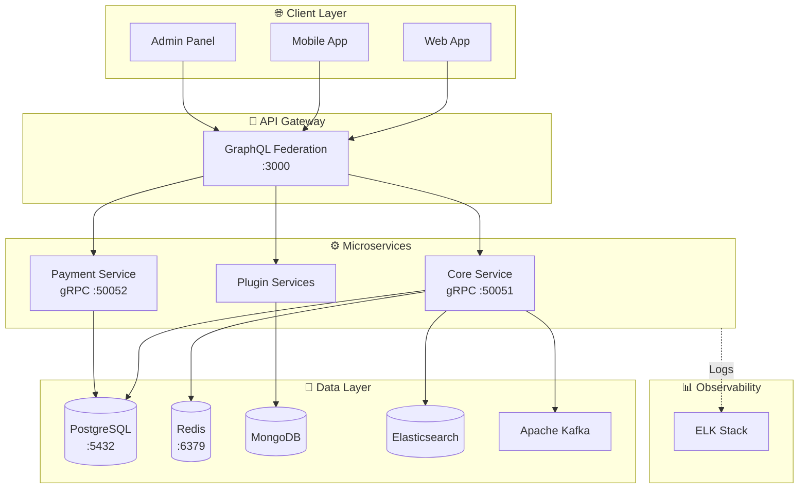

<div align="center">

# 🚀 9Plus CMS Backend Platform

**Enterprise-grade CMS backend with microservices architecture, SSO, real-time search, event-driven messaging, and centralized logging**

[](https://opensource.org/licenses/MIT)
[](https://www.typescriptlang.org/)
[](https://nodejs.org/)
[](https://nestjs.com/)
[](https://graphql.org/)
[](https://www.docker.com/)
[](http://makeapullrequest.com)

[Features](#-features) • [Quick Start](#-quick-start) • [Documentation](#-documentation) • [API](#-api-examples) • [Contributing](#-contributing)

</div>

---

## 📖 Overview

**9Plus CMS** is a production-ready content management system backend built with modern microservices architecture. It provides enterprise-grade features including plugin system, SSO authentication, Elasticsearch search, Kafka event streaming, and ELK stack logging.

### ✨ Features

- 🏗️ **Microservices Architecture** - GraphQL Federation & gRPC communication
- 🔌 **Dynamic Plugin System** - Hot-reload plugins via Git submodules
- 🔐 **Enterprise Security** - SSO, JWT, OAuth2, RBAC with CASL
- 🔍 **Real-time Search** - Elasticsearch powered full-text search
- 📊 **Event-Driven** - Apache Kafka for async messaging
- 📝 **Centralized Logging** - ELK Stack (Elasticsearch, Logstash, Kibana)
- 🚀 **Developer Experience** - TypeScript, Hot reload, Auto-generation
- 🐳 **Container-Native** - Docker & Kubernetes ready

---

## 🏗️ Architecture



### 🛠️ Tech Stack

| Category | Technologies |
|----------|-------------|
| **Backend** | Node.js 20+, TypeScript, NestJS 11+ |
| **API** | GraphQL Federation, gRPC, REST |
| **Databases** | PostgreSQL, MongoDB, Redis |
| **Search** | Elasticsearch |
| **Messaging** | Apache Kafka |
| **Logging** | ELK Stack (Elasticsearch, Logstash, Kibana) |
| **Auth** | JWT, OAuth2, OpenID Connect, CASL |
| **Container** | Docker, Docker Compose, Kubernetes |
| **Runtime** | Bun 1.0+ (recommended), Node.js |

---

## 🚀 Quick Start

### Prerequisites

- [Node.js](https://nodejs.org/) 20+
- [Bun](https://bun.sh/) 1.0+ (recommended)
- [Docker](https://www.docker.com/) & Docker Compose
- Git with submodule support

- **Node.js** (v20 or higher)
- **Bun** (v1.0 or higher) - [Install Bun](https://bun.sh/docs/installation)
- **Docker** and **Docker Compose**
- **Git** with submodule support

### 📦 Installation

1. **Clone the repository**:
   ```bash
   git clone https://github.com/anineplus/anineplus-api.git
   cd anineplus-api
   ```

2. **Complete setup (recommended)**:
   ```bash
   # Make scripts executable (Linux/Mac)
   bun run make-executable
   
   # Complete setup with event-driven architecture
   bun run dev:full
   ```

3. **Manual setup** (alternative):
   ```bash
   # Setup environment files
   bun run env:setup
   
   # Install all dependencies
   bun run install:all
   
   # Setup event-driven infrastructure
   bun run event-driven:setup
   
   # Start development environment
   bun run event-driven:start
   ```

4. **Verify setup**:
   ```bash
   # Check system health
   bun run verify
   
   # Test complete system
   bun run test:full
   ```

### 🎯 Event-Driven Architecture

This project now includes a complete **Event-Driven Architecture** with:

- **Kafka**: Message broker for event streaming
- **Elasticsearch**: Search engine and event storage
- **Kibana**: Data visualization and monitoring
- **Logstash**: Log processing and aggregation
- **Searcher Service**: Kafka consumer → Elasticsearch indexer
- **Logger Service**: Log collection and shipping

```
┌─────────────────┐    ┌──────────────────┐    ┌─────────────────┐
│   API Gateway   │────│   Core Service   │────│ Payment Plugin  │
│  (GraphQL Fed)  │    │     (Events)     │    │    (Events)     │
│     :3001       │    │     :3000        │    │     :3100       │
└─────────────────┘    └──────────────────┘    └─────────────────┘
         │                       │                       │
         └───────────────────────┼───────────────────────┘
                                 │ (Kafka Events)
         ┌───────────────────────┼───────────────────────┐
         │                       │                       │
┌─────────────────┐    ┌──────────────────┐    ┌─────────────────┐
│ Searcher Svc    │────│     Kafka        │────│   Logger Svc    │
│   :3002         │    │     :9092        │    │     :3003       │
└─────────────────┘    └──────────────────┘    └─────────────────┘
         │                       │                       │
         │                       │                       │
┌─────────────────┐    ┌──────────────────┐    ┌─────────────────┐
│ Elasticsearch   │    │   PostgreSQL     │    │ ELK Stack       │
│   :9200         │    │     :5432        │    │ (Kibana:5601)   │
└─────────────────┘    └──────────────────┘    └─────────────────┘
```

## 🛠️ Development

> **📖 For detailed development setup with hot reload, see [DEVELOPMENT.md](./DEVELOPMENT.md)**

The development environment supports automatic code reloading and includes all services:
- API Gateway (port 3000) - GraphQL endpoint
- User Service (port 50051) - gRPC microservice  
- Payment Service (port 50052) - gRPC microservice
- PostgreSQL (port 5432) - Database
- Redis (port 6379) - Cache

### Quick Development Start

```bash
# 1. Clone repository with submodules
git clone --recursive https://github.com/devhoangkien/anineplus-api.git
cd anineplus-api

# 2. Setup environment
bun run env

# 3. Install dependencies
bun run i:all

# 4. Start development environment
bun run docker:dev
```

### 📋 Available Scripts

> **📖 For complete scripts documentation, see [SCRIPTS.md](./SCRIPTS.md)**

#### 🚀 Quick Commands

| Command | Description |
|---------|-------------|
| `bun run dev:full` | **Complete setup and start (recommended)** |
| `bun run test:full` | **Test complete event-driven system** |
| `bun run verify` | **Health check and system verification** |

#### ⚙️ Setup & Configuration

| Command | Description |
|---------|-------------|
| `bun run env:setup` | Setup environment files from examples |
| `bun run install:all` | Install dependencies for all services |
| `bun run make-executable` | Make all scripts executable (Linux/Mac) |
| `bun run validate` | Validate development environment |

#### 🏗️ Development

| Command | Description |
|---------|-------------|
| `bun run event-driven:setup` | Setup Kafka + ELK infrastructure |
| `bun run event-driven:start` | Start all services in development mode |
| `bun run app:build` | Build all services and plugins |
| `bun run app:lint` | Run linting and code quality checks |

#### 🐳 Docker & Infrastructure

| Command | Description |
|---------|-------------|
| `bun run infra:up` | Start Kafka + ELK infrastructure |
| `bun run infra:down` | Stop infrastructure services |
| `bun run docker:dev:up` | Start development containers |
| `bun run docker:dev:down` | Stop development containers |

#### 🧹 Maintenance

| Command | Description |
|---------|-------------|
| `bun run cleanup` | Interactive cleanup of environment |
| `bun run verify` | Comprehensive system health check |

### Development Workflow

1. **Start development containers**:
   ```bash
   docker compose -f docker-compose-dev.yaml up -d
   ```

2. **Monitor logs**:
   ```bash
   docker compose -f docker-compose-dev.yaml logs -f
   ```

3. **Access services**:
   - API Gateway: http://localhost:3000
   - GraphQL Playground: http://localhost:3000/graphql

### Working with Submodules

This project uses Git submodules for applications. To work with them:

```bash
# Check health
curl http://localhost:3000/healthz

# Access GraphQL Playground
open http://localhost:3000/graphql
```

**🎉 Done! Your API is running at http://localhost:3000**

---

## 📁 Project Structure

```
anineplus-api/
├── apps/                    # Microservices (Git submodules)
│   ├── gateway/            # API Gateway (GraphQL Federation) :3000
│   ├── core/               # Core Service (Auth, Users) :50051
├── libs/                    # Shared libraries
│   ├── common/             # Common utilities, logger, decorators
│   └── casl-authorization/ # RBAC authorization with CASL
├── plugins/                 # Plugin services (Git submodules)
│   └── payment/            # Payment Service :50052
├── scripts/                 # Automation scripts
├── docs/                    # Documentation
├── docker-compose.yaml      # Production
├── docker-compose-dev.yaml  # Development
└── package.json
```

---

## 🔧 Configuration

### Environment Variables

Copy `example.env` to `.env` and configure:

```env
# Database
DB_HOST=localhost
DB_PORT=5432
DB_USERNAME=your_username
DB_PASSWORD=your_password
DB_DATABASE=nineplusdb

# Redis
REDIS_HOST=localhost
REDIS_PORT=6379

# JWT
JWT_ACCESSTOKEN_SECRET=your-secret-here
JWT_REFRESHTOKEN_SECRET=your-refresh-secret
JWT_ACCESS_EXPIRATION=15m
JWT_REFRESH_EXPIRATION=7d

# Services
GATEWAY_PORT=3000
CORE_SERVICE_URL=localhost:50051
PAYMENT_SERVICE_URL=localhost:50052

# Kafka
KAFKA_BROKERS=localhost:9092

# Elasticsearch
ELASTICSEARCH_NODE=http://localhost:9200
```

### Generate Secrets

```bash
# Generate JWT secrets
bash scripts/generate-jwt-secret.sh

# Or manually
node -e "console.log(require('crypto').randomBytes(32).toString('hex'))"
```

---

## 💻 Development

### Available Scripts

| Command | Description |
|---------|-------------|
| `bun run env` | Setup environment files |
| `bun run i:all` | Install all dependencies |
| `bun run gateway` | Run API Gateway |
| `bun run core` | Run Core service |
| `bun run payment` | Run Payment service |
| `bun run app:lint` | Lint all services |
| `bun run app:build` | Build all services |
| `bun run docker:dev` | Start dev environment |
| `bun run docker:dev:logs` | View logs |

### Development Workflow

```bash
# Start infrastructure
docker compose up -d postgres redis kafka elasticsearch

# Run services (in separate terminals)
bun run gateway  # Terminal 1
bun run core     # Terminal 2
bun run payment  # Terminal 3

# Or use Docker for everything
bun run docker:dev
```

### Working with Submodules

```bash
# Update submodules
git submodule update --init --recursive

# Update to latest
git submodule update --remote --recursive

# Work on submodule
cd apps/core
git checkout -b feature/new-feature
# Make changes...
git push origin feature/new-feature
```

---

## 📚 API Examples

### GraphQL API

Access GraphQL Playground at **http://localhost:3000/graphql**

#### Authentication

```graphql
# Register
mutation {
  register(input: {
    email: "user@example.com"
    password: "SecurePass123!"
    username: "johndoe"
  }) {
    id
    email
    username
  }
}

# Login
mutation {
  login(input: {
    email: "user@example.com"
    password: "SecurePass123!"
  }) {
    accessToken
    refreshToken
    user {
      id
      email
      username
      roles
    }
  }
}

# Get Profile
query {
  me {
    id
    email
    username
    profile {
      firstName
      lastName
    }
  }
}
```

#### User Management

```graphql
# Update Profile
mutation {
  updateProfile(input: {
    firstName: "John"
    lastName: "Doe"
  }) {
    id
    profile {
      firstName
      lastName
    }
  }
}

# Query Users
query {
  users(page: 1, limit: 10) {
    items {
      id
      username
      email
    }
    total
    hasMore
  }
}
```

### REST API

```bash
# Health Check
curl http://localhost:3000/healthz

# Login via REST
curl -X POST http://localhost:3000/api/auth/login \
  -H "Content-Type: application/json" \
  -d '{"email":"user@example.com","password":"SecurePass123!"}'

# Authenticated Request
curl http://localhost:3000/api/users/me \
  -H "Authorization: Bearer YOUR_JWT_TOKEN"
```

---

## 🧪 Testing

```bash
# Run all tests
bun test

# With coverage
bun test --coverage

# Watch mode
bun test --watch

# E2E tests
bun test:e2e

# Test specific service
cd apps/core && bun test
```

---

## 🚢 Deployment

### Docker Deployment

```bash
# Production
docker compose build
docker compose up -d

# Development
docker compose -f docker-compose-dev.yaml up -d

# View logs
docker compose logs -f

# Stop services
docker compose down
```

### Kubernetes Deployment

```bash
# Apply configurations
kubectl apply -f k8s/

# Check status
kubectl get pods -n nineplus

# View logs
kubectl logs -f deployment/gateway -n nineplus
```

---

## 📊 Monitoring & Logging

### ELK Stack

```bash
# Access Kibana
open http://localhost:5601

# Create index pattern: logs-*
# View and analyze logs
```

### Log Levels

- **ERROR** - Critical errors
- **WARN** - Warning conditions
- **INFO** - General information
- **DEBUG** - Detailed debugging

### View Logs

```bash
# All services
docker compose logs -f

# Specific service
docker compose logs -f gateway
```

---

## 🔒 Security

### Best Practices

- ✅ JWT with short expiration & refresh token rotation
- ✅ RBAC with CASL authorization
- ✅ Bcrypt password hashing (12 rounds)
- ✅ Rate limiting on API Gateway
- ✅ Input validation & sanitization
- ✅ CORS & security headers
- ✅ Environment variable encryption
- ✅ TLS/SSL in production

### Security Checklist

```bash
# Generate secure secrets
bash scripts/generate-jwt-secret.sh

# Scan dependencies
npm audit

# Fix vulnerabilities
npm audit fix

# Enable production mode
NODE_ENV=production
```

---

## ⚡ Performance

### Caching Strategy

- Redis caching for frequently accessed data
- GraphQL query caching
- Database connection pooling
- Proper indexing

### Scaling

```bash
# Horizontal scaling with Docker
docker compose up --scale gateway=3 --scale core=2

# Kubernetes scaling
kubectl scale deployment gateway --replicas=5
```

---

## 🔧 Troubleshooting

### Common Issues

**Port already in use:**
```bash
lsof -i :3000
kill -9 <PID>
```

**Docker build issues:**
```bash
docker system prune -a
docker compose build --no-cache
```

**Database connection:**
```bash
docker compose ps
docker compose logs postgres
docker compose down -v && docker compose up -d postgres
```

**Submodule issues:**
```bash
git submodule update --remote --recursive
git submodule foreach git reset --hard
```

---

## 🤝 Contributing

We welcome contributions! Please follow these steps:

1. **Fork** the repository
2. **Create** a feature branch: `git checkout -b feature/amazing-feature`
3. **Follow** coding standards: `bun run app:lint`
4. **Add** tests for new features
5. **Commit** changes: `git commit -m 'feat: add amazing feature'`
6. **Push** to branch: `git push origin feature/amazing-feature`
7. **Open** a Pull Request

### Commit Convention

Follow [Conventional Commits](https://www.conventionalcommits.org/):
- `feat:` New feature
- `fix:` Bug fix
- `docs:` Documentation
- `style:` Formatting
- `refactor:` Code restructuring
- `test:` Tests
- `chore:` Maintenance

---

## 🗺️ Roadmap

### Current (v1.0)
- [x] Microservices architecture
- [x] GraphQL Federation
- [x] SSO integration
- [x] Elasticsearch search
- [x] Kafka messaging
- [x] ELK logging

### Upcoming (v1.1 - Q2 2025)
- [ ] GraphQL subscriptions
- [ ] WebSocket support
- [ ] Multi-tenancy
- [ ] API versioning

### Future (v2.0 - Q4 2025)
- [ ] Service mesh (Istio)
- [ ] Distributed tracing
- [ ] AI/ML integration
- [ ] Mobile SDK

---

## 📄 License

This project is licensed under the **MIT License** - see [LICENSE](LICENSE) file.

```
MIT License - Copyright (c) 2025 DevHoangKien
Permission is hereby granted, free of charge, to any person obtaining a copy...
```

---

## 💬 Support & Community

### Get Help

- 📖 **Documentation**: [docs/](./docs)
- 🐛 **Issues**: [GitHub Issues](https://github.com/devhoangkien/anineplus-api/issues)
- 💡 **Discussions**: [GitHub Discussions](https://github.com/devhoangkien/anineplus-api/discussions)
- 📧 **Email**: devhoangkien@gmail.com
- 🔒 **Security**: Report vulnerabilities via email

### Links

- [Architecture Documentation](docs/ARCHITECTURE.md)
- [API Documentation](docs/API.md)
- [Contributing Guide](CONTRIBUTING.md)
- [Code of Conduct](CODE_OF_CONDUCT.md)
- [Changelog](CHANGELOG.md)

---

## 🙏 Acknowledgments

Built with amazing open-source projects:
[NestJS](https://nestjs.com/) • [GraphQL](https://graphql.org/) • [Apollo](https://www.apollographql.com/) • [Elasticsearch](https://www.elastic.co/) • [Kafka](https://kafka.apache.org/) • [PostgreSQL](https://www.postgresql.org/) • [Redis](https://redis.io/) • [Docker](https://www.docker.com/) • [TypeScript](https://www.typescriptlang.org/)

---

## 📊 Stats


---

<div align="center">

**⭐ Star this repo if you find it helpful!**

Made with ❤️ by [DevHoangKien](https://github.com/devhoangkien) and [Contributors](https://github.com/devhoangkien/anineplus-api/graphs/contributors)

[⬆ Back to Top](#-9plus-cms-backend-platform)

</div>