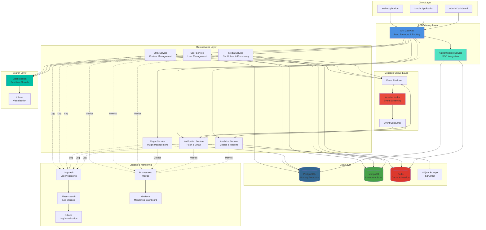

# 9Plus CMS - System Architecture Diagram

## Overview
9Plus CMS is a microservice-based backend platform with plugin architecture, supporting SSO integration, real-time search, event-driven processing, and centralized logging.

## System Architecture



## Architecture Components

### 1. Client Layer
- **Web Application**: Frontend web interface
- **Mobile Application**: iOS/Android apps
- **Admin Dashboard**: Administrative interface

### 2. API Gateway Layer
- **API Gateway**: Entry point for all client requests, handles routing and load balancing
- **Authentication Service**: SSO integration, JWT token management, OAuth2 support

### 3. Microservices Layer
- **CMS Service**: Core content management functionality
- **User Service**: User authentication, profile management
- **Media Service**: File upload, processing, and delivery
- **Plugin Service**: Plugin management and dynamic loading
- **Notification Service**: Push notifications, email, SMS
- **Analytics Service**: Data analytics and reporting

### 4. Message Queue Layer
- **Apache Kafka**: Event streaming platform for asynchronous communication
- **Event Producer**: Services publish events
- **Event Consumer**: Services consume and process events

### 5. Search Layer
- **Elasticsearch**: Real-time search and indexing
- **Kibana**: Search analytics and visualization

### 6. Data Layer
- **PostgreSQL**: Primary relational database for structured data
- **MongoDB**: Document store for flexible schema data
- **Redis**: Caching and session management
- **S3/MinIO**: Object storage for media files

### 7. Logging & Monitoring (ELK Stack)
- **Logstash**: Centralized log collection and processing
- **Elasticsearch**: Log storage and indexing
- **Kibana**: Log visualization and analysis
- **Prometheus**: Metrics collection
- **Grafana**: Monitoring dashboards

## Key Features

### ✨ Microservice Architecture
- Independent services with single responsibility
- Loosely coupled components
- Scalable and maintainable

### 🔐 SSO Integration
- Centralized authentication
- OAuth2 and OpenID Connect support
- JWT token-based authorization

### 🔍 Real-time Search
- Elasticsearch integration
- Full-text search capabilities
- Instant search results

### 📊 Event-Driven Architecture
- Kafka-based event streaming
- Asynchronous communication
- Decoupled services

### 📝 Centralized Logging
- ELK stack implementation
- Real-time log aggregation
- Advanced log analysis

### 🔌 Plugin Architecture
- Dynamic plugin loading
- Extensible functionality
- Custom module support

## Technology Stack

### Backend
- **Runtime**: Node.js
- **Language**: TypeScript (94%)
- **Framework**: NestJS / Express

### Infrastructure
- **Containerization**: Docker
- **Orchestration**: Kubernetes / Docker Compose
- **Message Queue**: Apache Kafka
- **Search Engine**: Elasticsearch
- **Cache**: Redis

### Databases
- **Relational**: PostgreSQL
- **NoSQL**: MongoDB
- **Cache**: Redis

### Monitoring & Logging
- **Logging**: ELK Stack (Elasticsearch, Logstash, Kibana)
- **Monitoring**: Prometheus + Grafana
- **Tracing**: Jaeger / Zipkin (optional)

## Deployment Strategy

### Development
- Local Docker Compose setup
- Hot reload for rapid development
- Local Kafka and Elasticsearch instances

### Staging
- Kubernetes cluster
- CI/CD pipeline integration
- Automated testing

### Production
- Multi-region deployment
- Auto-scaling enabled
- High availability configuration
- Disaster recovery plan

## Security Considerations

1. **Authentication & Authorization**
   - SSO integration
   - JWT token validation
   - Role-based access control (RBAC)

2. **API Security**
   - Rate limiting
   - API key validation
   - Request validation and sanitization

3. **Data Security**
   - Encryption at rest
   - Encryption in transit (TLS/SSL)
   - Sensitive data masking in logs

4. **Network Security**
   - Private subnets for services
   - Security groups and firewall rules
   - VPN access for internal services

## Scalability

- **Horizontal Scaling**: Add more service instances
- **Vertical Scaling**: Increase resources per instance
- **Database Sharding**: Distribute data across multiple databases
- **Caching Strategy**: Multi-layer caching with Redis
- **CDN Integration**: Static asset delivery

## Future Enhancements

- [ ] GraphQL API Gateway
- [ ] Service Mesh (Istio/Linkerd)
- [ ] Distributed Tracing
- [ ] AI/ML Integration
- [ ] Real-time Collaboration Features
- [ ] Multi-tenancy Support

---

**Repository**: [devhoangkien/anineplus-api](https://github.com/devhoangkien/anineplus-api)

**Last Updated**: 2025-10-06
```
